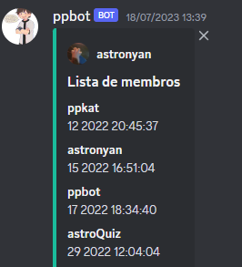
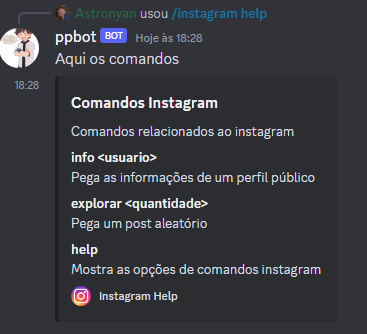
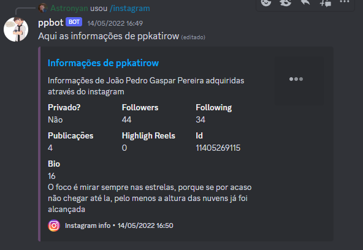

# Instagram web scrapper discord bot
This project is a discord bot that brings the Instagram into discord.
Using the puppeteer, the bot grab the Instagram information, post and images.

## Technology 

Here are the technologies used in this project.

* Discord.js version 13.6.0
* Puppeteer version 13.7.0

## Getting started

1 - Install dependencies: 

[Install Google Chrome](https://www.google.com/chrome/)

[Install Nodejs](https://nodejs.org/)

2 - Clone the repository running into your terminal:

```sh
git clone https://github.com/ppkat/Web-Scrapper-Discord-Bot.git
```

3 - Install the required packages using:

```
npm i
```

## How to use

### 1 - First you need to create your bot on [discord API](https://discord.com/developers)

### 2 - When you get your bot token, you must create a .env file on the root of the project.

The .env file should have 5 environment vars:

```
LOGIN_EMAIL_INSTAGRAM = "YOUR_INSTAGRAM_LOGIN@EMAIL.COM"
LOGIN_PASSWORD_INSTAGRAM = "YOUR_INSTAGRAM_PASSWORD"
BOT_TOKEN = "YOUR TOKEN GOES HERE"
CLIENT_ID = "YOUR BOT CLIENT ID"
SERVER_ID = "THE SERVER THAT YOU WANT PUT THE BOT"
```

### 3 - After put your bot on your server, you must run the "deploys-commands.js" file to register the slash commands on discord server.

### 4 - Then run index.js file and the bot goes up!

## Features

### Commands:

 #### 1. Members
 Shows up a list of all members on the server.

 


 #### 2. Instagram help
Dynamically shows the Instagram commands with their respective descriptions. When a new command is created, this commands automatically get the command information

 

 #### 3. Instagram info
 Get information about a given Instagram profile

 

 ### 4. Instagram explorar
 Acess the instagram.com/explore and grab posts and send on discord

 

  ## Authors

  * **João Pedro Gaspar Pereira** 

  Please follow github and give me a star if you like the project!
  I am always open to suggest so feel free to give me ideas or contribute!